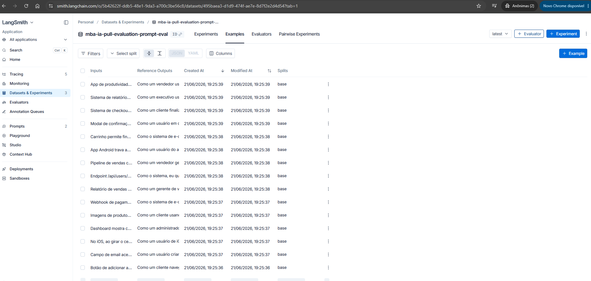
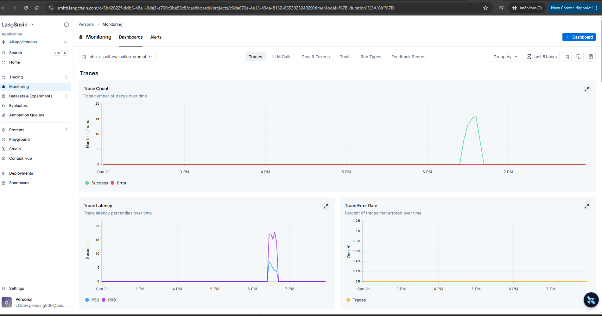
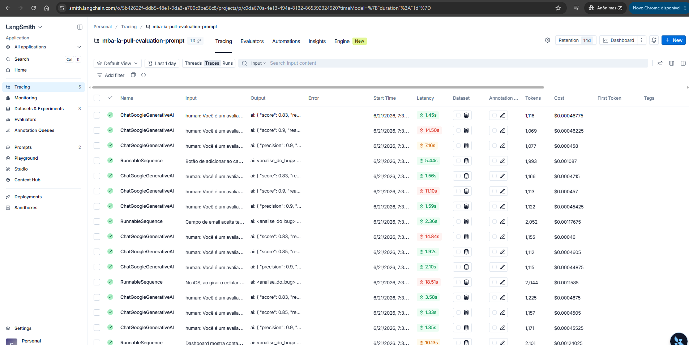
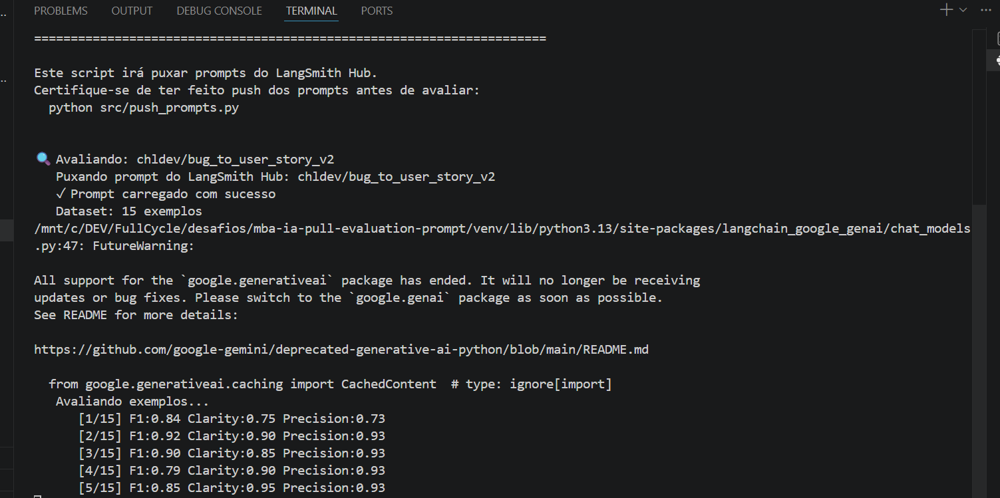
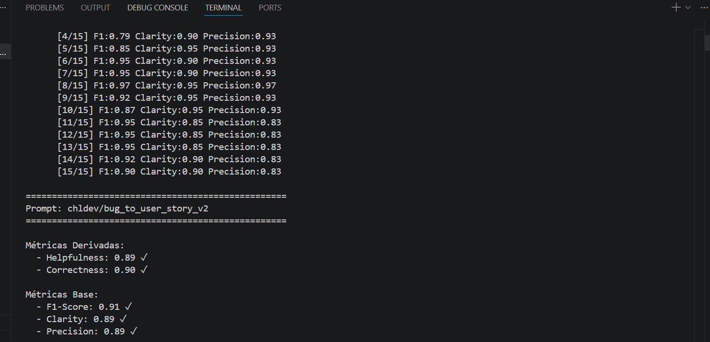
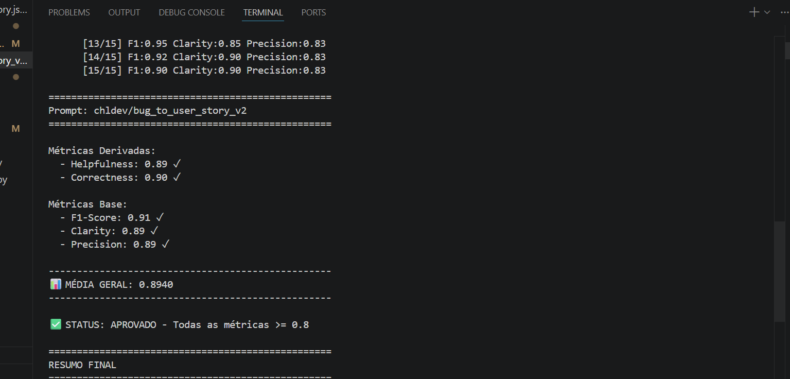
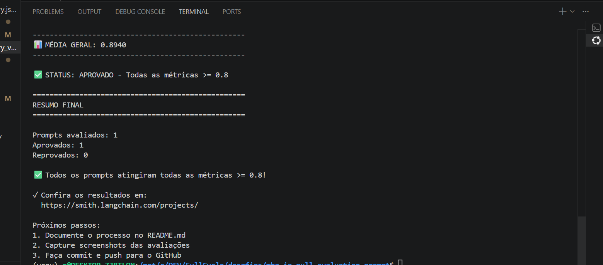

# Pull, Otimização e Avaliação de Prompts com LangChain e LangSmith

Projeto desenvolvido para o desafio de pull, otimização, publicação e avaliação de prompts usando LangChain, LangSmith Prompt Hub e métricas customizadas. O caso trabalhado converte relatos de bugs em User Stories acionáveis para equipes de produto, QA e desenvolvimento.

## Status da Entrega

| Requisito | Implementação | Evidência |
| --- | --- | --- |
| Pull do prompt inicial | `src/pull_prompts.py` baixa `leonanluppi/bug_to_user_story_v1` e salva o YAML local | `prompts/bug_to_user_story_v1.yml` |
| Prompt otimizado | Prompt v2 com System/User Prompt, Few-shot, BDD, tratamento de edge cases e regras contra alucinação | `prompts/bug_to_user_story_v2.yml` |
| Push ao LangSmith Hub | `src/push_prompts.py` valida o YAML, monta `ChatPromptTemplate` e publica o prompt como público | [`chldev/bug_to_user_story_v2`](https://smith.langchain.com/hub/chldev/bug_to_user_story_v2) |
| Avaliação automática | `src/evaluate.py` cria/usa dataset com 15 exemplos, puxa o prompt do Hub e calcula as 5 métricas | `resultados/resultados_v2.txt` |
| Métricas customizadas | Helpfulness, Correctness, F1-Score, Clarity e Precision | `src/metrics.py` |
| Testes de validação | 6 testes exigidos pelo desafio implementados em `pytest` | `tests/test_prompts.py` |

Validação local executada:

```bash
venv\Scripts\python.exe -m pytest tests\test_prompts.py -q
```

Resultado: `6 passed in 0.05s`.

## Técnicas Aplicadas (Fase 2)

O prompt v1 era propositalmente superficial: gerava respostas curtas, sem critérios de aceite e com pouca proteção contra perda de contexto. O prompt v2 foi refatorado para produzir User Stories completas, testáveis e aderentes ao bug reportado.

| Técnica | Por que foi escolhida | Exemplo prático de aplicação |
| --- | --- | --- |
| Few-shot Learning | Técnica obrigatória do desafio e essencial para reduzir ambiguidade no formato esperado | O prompt inclui dois pares `Input`/`Output`: um relato completo de erro no PIX e um relato vago sobre botão de salvar |
| Role Prompting | Ancora o modelo em uma persona com vocabulário e prioridades adequadas ao domínio | `Você é um Product Owner Sênior e Especialista em Qualidade de Software (QA)` |
| Separação System/User Prompt | Isola regras, formato e exemplos da entrada variável do usuário | `system_prompt` contém as instruções; `user_prompt` recebe apenas `{bug_report}` |
| Chain of Thought estruturado | Obriga a separar fatos observados de inferências, aumentando Correctness e Precision | A seção `<analise_do_bug>` exige `Fatos Relatados`, `Hipóteses Técnicas` e `Impacto` |
| Skeleton of Thought | Padroniza a resposta e reduz variação estrutural entre execuções | Saída fixa em Markdown com `Título`, `User Story`, `Critérios de Aceite` e `Notas Técnicas` |
| BDD nos critérios de aceite | Torna os critérios verificáveis por QA e desenvolvedores | Cada cenário usa o padrão `Dado / Quando / Então` |
| Tratamento de edge cases | Evita alucinação quando o relato é incompleto | Quando faltam dados, o prompt adiciona `Informações Pendentes (Refinamento)` com perguntas objetivas |

Essas decisões atacam diretamente as métricas avaliadas: a estrutura BDD e o Skeleton melhoram Clarity e Helpfulness; a separação entre fatos e hipóteses reduz alucinações e melhora Precision; os exemplos Few-shot estabilizam o formato e aumentam F1-Score e Correctness.

## Resultados Finais

A avaliação foi executada com provider Google e modelo `models/gemini-3.1-flash-lite-preview`, conforme os logs salvos em `resultados/resultados_v1.txt` e `resultados/resultados_v2.txt`.

| Métrica | Prompt v1 | Prompt v2 | Ganho |
| --- | ---: | ---: | ---: |
| Helpfulness | 0.54 | 0.89 | +0.35 |
| Correctness | 0.52 | 0.90 | +0.38 |
| F1-Score | 0.48 | 0.91 | +0.43 |
| Clarity | 0.51 | 0.89 | +0.38 |
| Precision | 0.56 | 0.89 | +0.33 |
| Média geral | 0.5219 | 0.8940 | +0.3721 |
| Status | Reprovado | Aprovado | Todas as métricas >= 0.8 |

### Evidências LangSmith

- Dataset público com 15 exemplos: [LangSmith Dataset](https://smith.langchain.com/public/33b4bbbe-0293-43b3-9e47-bb1525031128/d?tab=2)
- Trace público 1: [RunnableSequence com feedback](https://smith.langchain.com/public/a78588cd-5f5d-4dbf-b19d-58cf03ffab72/r?scroll_to=feedback)
- Trace público 2: [RunnableSequence](https://smith.langchain.com/public/f28ddde1-300b-4f98-abed-3db1fcb98127/r)
- Trace público 3: [RunnableSequence](https://smith.langchain.com/public/502501c3-fe97-4ce1-bc42-9121ec7d7569/r)
- Trace público 4: [RunnableSequence](https://smith.langchain.com/public/3750bab3-405f-415a-872e-ba3eda78ec02/r)

### Screenshots do LangSmith

| Dataset | Dashboard | Trace |
| --- | --- | --- |
|  |  |  |

### Screenshots das Avaliações

| Execução 1 | Execução 2 |
| --- | --- |
|  |  |

| Execução 3 | Execução 4 |
| --- | --- |
|  |  |

## Como Executar

### Pré-requisitos

- Python 3.9+
- Conta e API Key do LangSmith
- API Key de um provider LLM compatível:
  - OpenAI, usando `OPENAI_API_KEY`
  - Google Gemini, usando `GOOGLE_API_KEY`
- Dependências listadas em `requirements.txt`

### Instalação

```bash
python -m venv venv
venv\Scripts\activate
pip install -r requirements.txt
```

No Linux/macOS:

```bash
python3 -m venv venv
source venv/bin/activate
pip install -r requirements.txt
```

### Configuração

Crie o arquivo `.env` a partir de `.env.example` e preencha as credenciais:

```env
LANGSMITH_TRACING=true
LANGSMITH_ENDPOINT=https://api.smith.langchain.com
LANGSMITH_API_KEY=<sua-chave-langsmith>
LANGSMITH_PROJECT=<seu-projeto-langsmith>
USERNAME_LANGSMITH_HUB=<seu-usuario-no-hub>

LLM_PROVIDER=google
GOOGLE_API_KEY=<sua-chave-google>
LLM_MODEL=gemini-2.5-flash
EVAL_MODEL=gemini-2.5-flash
```

Também é possível usar OpenAI:

```env
LLM_PROVIDER=openai
OPENAI_API_KEY=<sua-chave-openai>
LLM_MODEL=gpt-4o-mini
EVAL_MODEL=gpt-4o
```

### Fases de execução

1. Baixar o prompt inicial do LangSmith Hub:

```bash
python src/pull_prompts.py
```

2. Validar o prompt otimizado localmente:

```bash
python -m pytest tests/test_prompts.py -q
```

3. Publicar o prompt otimizado no LangSmith Hub:

```bash
python src/push_prompts.py
```

4. Executar a avaliação:

```bash
python src/evaluate.py
```

O script de avaliação cria ou reutiliza o dataset `{LANGSMITH_PROJECT}-eval`, avalia `{USERNAME_LANGSMITH_HUB}/bug_to_user_story_v2` contra os 15 exemplos de `datasets/bug_to_user_story.jsonl` e exibe o status final no terminal.

## Estrutura do Projeto

```text
mba-ia-pull-evaluation-prompt/
├── datasets/
│   └── bug_to_user_story.jsonl
├── prompts/
│   ├── bug_to_user_story_v1.yml
│   └── bug_to_user_story_v2.yml
├── resultados/
│   ├── resultados_v1.txt
│   ├── resultados_v2.txt
│   └── telas/
├── src/
│   ├── evaluate.py
│   ├── metrics.py
│   ├── pull_prompts.py
│   ├── push_prompts.py
│   └── utils.py
└── tests/
    └── test_prompts.py
```

